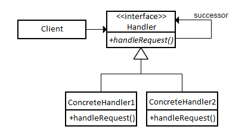

# Chain of Responsibility Pattern

Sometimes you want to issue a request \(operation\) somewhere in the code, and you don't know exactly how many objects/functions should react to this request, and you may need to determine who handles this request in runtime.

## Intent

Avoid coupling the sender of a request to its receiver by giving more than one object the chance to handle the request. Chain the receiving objects and pass the request along the chain and each object can decide wether to handle it alone, handle it and passes it to the next, or passes it directly to the next.

## When to use

1. When your program is expected to process different kinds of requests in various ways, but the exact types of requests and their sequences are unknown beforehand **\(as backend api applications\)**.
2. When it’s essential to execute several handlers in a particular order.
3. When the set of handlers and their order are supposed to change at runtime.

## Structure

* **Handler:** defines an interface for handling requests \(can be an abstract class and implement the successor link or some of the common functionality if any\).
* **ConcreteHandler:** handles the request it's responsible for, can access its successor, and should decide if it wants to handle the request or forwards it to the successor.

## Note

Chain of Responsibility can be applied in conjunction with the **Composite Pattern** as the component's parent can act as its successor in the chain \(moving backwards\).

## Example

The first example is trying to replicate a basic server as **express**, so the code just gives the needed classes to make a server, the actual handlers are written inside the tests so it's a must to see the tests.

Please note that I decided to go with an approach that better suits TypeScript, it may not be good to implement it this way in a more object-oriented language, but the example can be easily refactored to depend on **ConcreteHandlers** and overriding their handle method instead of relying on a callback that's sent from the client code \(depending on extending the Base Class of the Handler to create classes instead of objects for short\).

| Source Code | UML |
| :---: | :---: |
| [Example 1](https://github.com/khaled-hamam/ts-design-patterns/tree/9a9bacf47635b736d3fdc4ffdb6fc5abb1e729f8/library/Behavioral%20Patterns/Chain%20of%20Responsibility/example_1.ts) | _TODO_ |

You can find the tests [here](https://github.com/khaled-hamam/ts-design-patterns/tree/9a9bacf47635b736d3fdc4ffdb6fc5abb1e729f8/library/Behavioral%20Patterns/Chain%20of%20Responsibility/index.test.ts).

